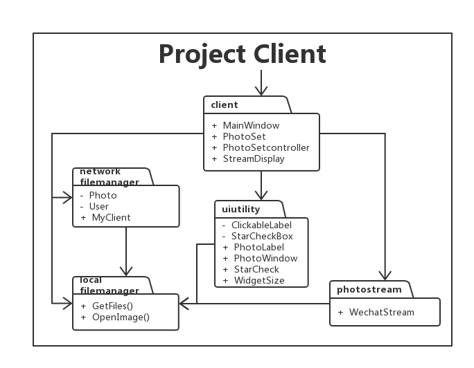
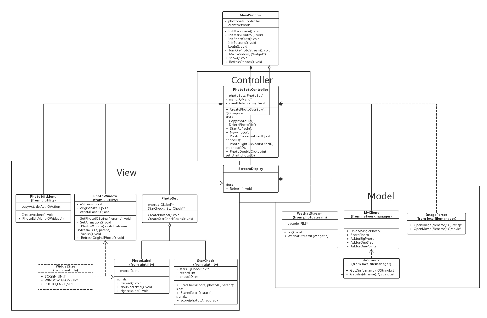

<!--
Created by Qibin Chen on 22/05/2017.
-->

Documentation - Client
================

*   [Overview](#overview)
*   [Classes](#classes)
    *   [MainWindow](#mainwindow)
    *   [PhotoSet](#photoset)
    *   [PhotoSetsController](#photosetscontroller)
    *   [StreamDisplay](#streamdisplay)
*   [Libraries](#libraries)
    *   [PhotoStream](#photostream)
    *   [ClientNetwork](#clientnetwork)
    *   [UiUtility](#uiutility)
    *   [LocalFileManager](#localfilemanager)

---

<h2 id="overview">Overview</h2>

*   This is the desktop version of Facemash2_client.
*   Package Diagram



*   Class Diagram



---

<h2 id="classes">Classes</h2>

<h3 id="mainwindow">MainWindow</h3>

##### Abstract

*   The Main VIEW of the ui.

##### private:

*   InitMainScene

    ```c++
    void InitMainScene();
    ```
    *   Initialize the main layout.
    *   This Includes photoArea, albumArea, photoSetsController, albumController.
    
*   InitMainControl

    ```c++
    void InitMainControl();
    ```
    *   Initialize the controllers.
    *   This Includes photoArea, albumArea, photoSetsController, albumController.

*   InitShortCuts

    ```c++
    void InitShortCuts();
    ```
    *   Initialize the short cuts of the main window.
    *   Including copy action and delete action.

##### public:

*   MainWindow
    
    ```c++
    MainWindow(QWidget *parent = nullptr);
    ```
    *   Constructor of the main window.
    *   Window properties such as title, menu, main layout should be initialized here.

*  LogIn

    ```c++
    void LogIn();
    ```
    *   Called after the user clicks the 'log in' button. The app will connect to the server and enable all the features. Disabled when the app failed to connect to the Internet.

*	TurnOnPhotoStream

 	```c++
	void TurnOnPhotoStream();
	```
	*	 Called after the user clicks the 'Wechat' button. This will pop up a image window showing the QR code.

*   RefreshPhotos

    ```c++
    void RefreshPhotos();
    ```
    *   This Requests the controller to do the refreshing and when it completes, slot RefreshComplete() will be activated.
    *   Should be called when photos have changed or the view(ex: number of photos per row) has changed.
    *   The task is delegated to a photoSetsController asynchronously, So the view won't update immediately.

<h3 id="photoset">PhotoSet</h3>

##### Abstract

*   This is the VIEW of a photo set, derived from QGroupBox.

##### private

*	CreateStarCheckBoxes

    ```c++
    void PhotoSet::CreateStarCheckBoxes(QGridLayout *layout);
    ```
	*	Creating the score star bar below the photo labels.

##### public:

*   PhotoSet

    ```c++
    PhotoSet(int setID, QList<QString> fileList, const QString &title, QWidget *parent);
        
    setID       -   ID of this set.
    fileList    -   file list.
                    ex: ["set1/image1.jpg", "set1/image2.jpg"]
    title       -   title of the GroupBox.
                    ex: "photoset1" / "yesterday" / "starred".
    ```

##### public slots:

*   PhotoClicked

    ```c++
    void PhotoClicked(int i);
        
    void PhotoRightClicked(int i);
        
    void PhotoDoubleClicked(int i);
    ```
    *   These slots accept click signals from all photo labels that the photo set contains.

##### signals:

*   photoClicked

    ```c++
    void photoClicked(int setID, int photoID);
    
    void photoDoubleClicked(int setID, int photoID);
    
    void photoRightClicked(int setID, int photoID);
    ```
    *   As the slots above collect all the signals from the set's photos, these signals are emitted meanwhile.
    *   These signals will be passed to a photoSetsController which will take action.

<h3 id="photosetscontroller">PhotoSetsController</h3>

##### Abstract

*	 PhotoSet - viewcontroller

##### private:

*   photoSets
*   
    ```c++
    PhotoSet **photoSets;
    ```
    *   Pointers to the photoSets which it currently controls.
    *   The controller has slots which receive the clicked signals from them.

*   CreatePhotoSetsBox

    ```c++
    QGroupBox *CreatePhotoSetsBox();
    ```
    *   Creates a QGroupBox of PhotoSets, which are QGroupBoxes of PhotoLabels themselves.

##### public slots:

*   PhotoClicked

    ```c++
    void PhotoClicked(int setID, int photoID);
    
    void PhotoDoubleClicked(int setID, int photoID);
    
    void PhotoRightClicked(int setID, int photoID);
    ```

*	 NewPhoto

	 ```c++
	 void NewPhoto()
	 ```
	 *		This will pop up a dialog asking for the new photo.

<h3 id="streamdisplay">StreamDisplay</h3>

##### Abstract

*	 The 'danmu' viewcontroller of wechat stickers and photos.

##### public:

*	 StreamDisplay

    ```c++
    StreamDisplay(QString from_dir = "wechat_photo_stream_temp/", QObject *parent = nullptr);
    ```
	 *	  The folder of the stream photos.

##### public slots:
*	 Refresh
    
    ```c++
    void Refresh();
    ```
    *	 This will search in the stream folder and present new photos.

---

<h2 id="libraries">Libraries</h2>

* <a id="photostream" href="../libs/photostream/docs/photostream.md" title="PhotoStream Documentation">PhotoStream</a>

* <a id="clientnetwork" href="../libs/clientnetwork/docs/clientnetwork.md" title="ClientNetwork Documentation">ClientNetwork</a>

* <a id="uiutility" href="../libs/uiutility/docs/uiutility.md" title="UiUtility Documentation">UiUtility</a>

* <a id="localfilemanager" href="../libs/localfilemanager/docs/localfilemanager.md" title="LocalFileManager Documentation">LocalFileManager</a>
