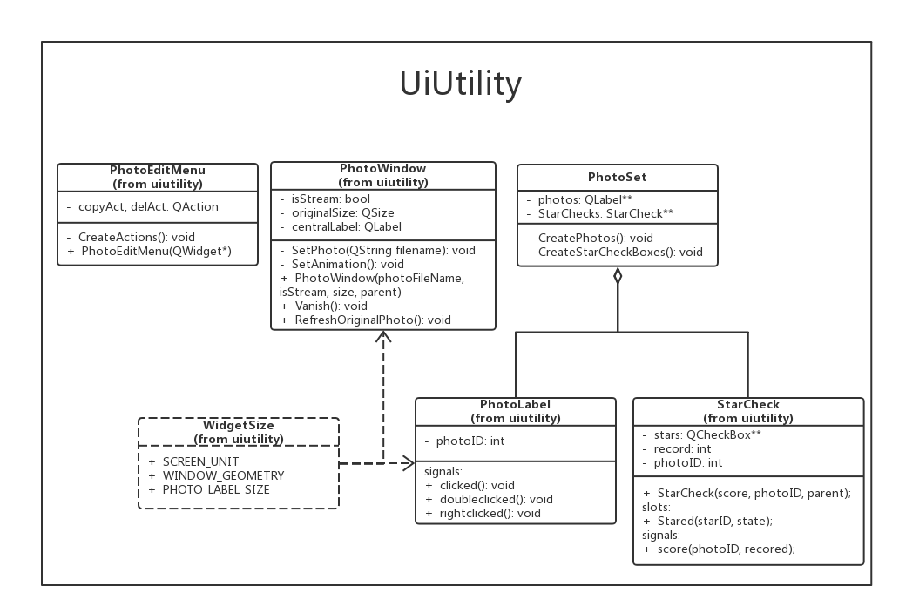

<!--
Created by Qibin Chen on 20/06/2017.
-->

Documentation - UiUtility
================

*   [Overview](#overview)
*   [Classes](#classes)
    *   [PhotoLabel](#photolabel)
    *   [StarCheckBox](#starcheckbox)
    *   [StarCheck](#starcheck)
    *   [PhotoEditMenu](#photoeditmenu)
    *   [PhotoWindow](#photowindow)
    *   [WidgetSize](#widgetsize)
*   [Libraries](#libraries)
    *   [LocalFileManager](#localfilemanager)

---

<h2 id="overview">Overview</h2>

*   This Library includes UI components used in the client app.

*   Class Diagram



<h2 id="classes">Classes</h2>

<h3 id="photolabel">PhotoLabel</h3>

##### Abstract

*   Labels that deal with clicking events on them and will emit corresponding signals. Derived from ClickableLabel.

##### signals:

*   Clicked

    ```c++
    void clicked(int id);
    void rightClicked(int id);
    void doubleClicked(int id);
    ```

<h3 id="starcheckbox">StarCheckBox</h3>

##### Abstract

*   A StarCheck object has five(or more) starcheckboxes, which makes it more flexible and user-friendly.

##### signals:

*   stateChanged

    ```c++
    void stateChanged(int id, int state);
    ```

<h3 id="starcheck">StarCheck</h3>

##### Abstract

*   A group of stars that are displayed under every photo. The user can click on each star and the StarCheck will receive the signal from a starcheckbox and finally pass it to a PhotoSetController.
*   After a user has scored, the starcheck should show the score he has just scored instead of computing and showing the average score immediately. The average points will be displayed next time the user log in or after a while.

##### public slots:

*   Stared

    ```c++
    void Stared(int id, int state);
    ```
    *   Receptor of the staring event from all five stars.

##### signals:

*   score

    ```c++
    void score(int photoID, int record);
    ```
    *   Emitted when the score this StarCheck takes has changed. A PhotoSetsController takes it and uses the network apis to send the info to the server.

<h3 id="photoeditmenu">PhotoEditMenu</h3>

##### Abstract 

*   If you right click on a PhotoLabel, you will see this simple menu.
*   Actions:
    1. copyAct - copy the image to clipboard.
    2. deleteAct - delete the image.

<h3 id="photowindow">PhotoWindow</h3>

##### Abstract

*   This includes the photo detail window and the tanmu window.

##### private:

*   SetPhoto

    ```c++
    void SetPhoto(QString photoFileName);
    ```
    *   Initialize or change the photo it displays.

*   SetAnimation

    ```c++
    void SetAnimation();
    ```
    *   Initialization of the window animation effects. This determines f it's a detailed window or a floating danmu window.

##### public slots:

*   RefreshOriginalPhoto

    ```c++
    void RefreshOriginalPhoto(QStringList);
    ```
    *   This function makes sense because when a detailed window is requested, it takes time to download that exact photo from the server. So the app shouldn't keep the user waiting and confused. Then I decided that the window should pop up immediately and show the thumbnails at first. When the original photo arrived, the controller will inform this photowindow and it finally shows that high-quality photo.

<h3 id="widgetsize">WidgetSize</h3>


*   This file includes size definitions of some common ui widgets.

    ```c++
    #define SCREEN_UNIT QApplication::desktop()->screenGeometry().width() / 480
    
    #define WINDOW_GEOMETRY QRect(60 * SCREEN_UNIT, 40 * SCREEN_UNIT, 360 * SCREEN_UNIT, 240 * SCREEN_UNIT)
    
    #define PHOTO_LABEL_SIZE QSize(80 * SCREEN_UNIT, 80 * SCREEN_UNIT)
    
    ```
*   In this way the app looks good on computers with different desktop resolutions.

<h2 id="libraries">Libraries</h2>

* <a id="localfilemanager" href="../libs/localfilemanager/docs/localfilemanager.md" title="LocalFileManager Documentation">LocalFileManager</a>
