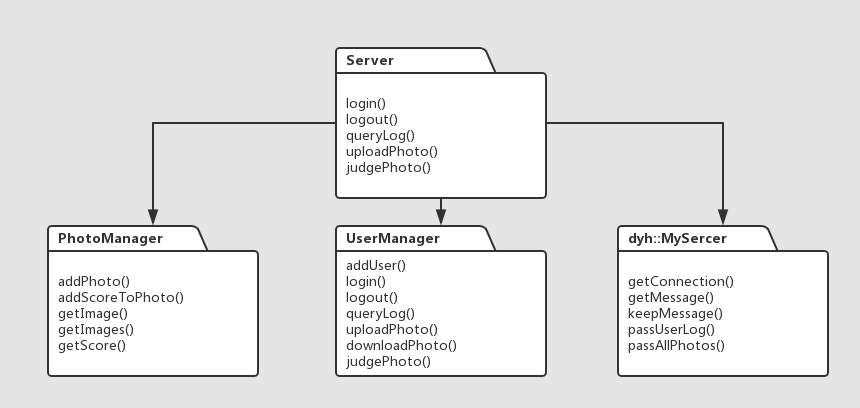
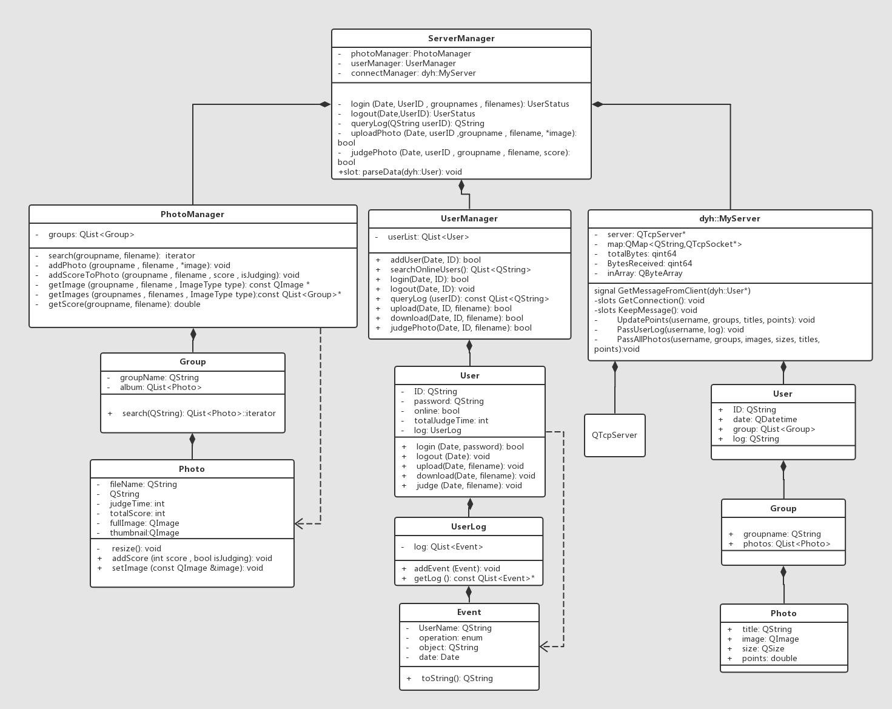

#Documentation - Server

[TOC]

## Overview

* This is the desktop version of Facemesh2_server.

* Package Diagram

  

* Class Diagram

  


---

## Classes

### ServerManager

Abstract

* The main part of the server, managing users and photos and communicating with client.

Private:

* `*userManager`
* `*photoManager`
* `*myServer`
  * these pointers can be set arbitrarily with different specific objects, and this will significantly improve the app's flexibility. The idea is the same as the strategy pattern, however considering that server shouldn't change its functions often, I just fix the interfaces of these sub managers.

Public:

* Constructor

  ```c++
  ServerManager(){
          userManager = new UserManager;
          photoManager = new PhotoManager;
          myServer = new dyh::MyServer(this);
          QObject::connect(myServer, SIGNAL(GetMessageFromClient(dyh::User*)), this, SLOT(parseData(dyh::User*)));
      }
  ```

  Create the sub managers objects and prepare for the Tcp connection.

  Connect the "get message from client" signal with "parse data" function.

* Users' operations

  ```c++
  UserStatus signUp (Date date , QString userID , QString password = QString::null);
  UserStatus login (server::Date date , QString UserID , QList<QString> groupnames , QList<QString> 					filenames , QString password = "");
  UserStatus logout(Date date, QString UserID);
  QList<QString> queryLog(QString userID);
  ```

  These functions will be called when user has corresponding activities, server will receive corresponding signals and log the operations. (But queryLog() operation will not be log :)

* Photo-related operations

  ```c++
  bool uploadPhoto (server::Date date , QString userID , QString groupname , QString filename , QImage 				*image);

  bool judgePhoto (server::Date date , QString userID , QString groupname , QString filename ,
                   int score);
  bool unJudgePhoto (server::Date date , QString userID , QString groupname , QString filename ,
                     int score);
  const QList<QImage> *initClientWithThumbnails (QList<QString> groupnames , QList<QString> filenames);
  const QImage *responseWithFullImage (QString username , QString groupname , QString filename);
  ```

  These functions will update the photos' information and broadcast the information to all of the online users. 

  The last two functions are called when users log in (we need to init the client with thumbnails) or click a photo (we need to response the click with the full image).

* communication operations

  ```c++
  public slots:
      void parseData(dyh::User *userData);
  ```

  `dyh::User` is the data structure of communication information. It contains the user's ID, operations and related data. By the enum type `ClientType` in `struct User` we can switch in different cases and handle the requirement.

  After dealing with the receiving messages, the server will call send message functions provided by `dyh::Server`, which will be explained in detail in the communication part's document.

### UserManager

Abstract

* The class that manages users. Including saving the users' private information and handle the users' operations.

Private:

* `QList<User> userList`
  * This class contains users' information.
* other small functions used by following public functions. They are easy to understand and have little influence on the macro structure so I omit them.

Public:

* log in related function

  ```c++
      bool login(Date date, QString ID, QString password = QString::null);
      void logout(Date date, QString ID);
      bool changeUserPw (Date date , QString ID , QString oldPw , QString newPw);
  ```

  The users' operations will be logged and the online status is important for many functions of `UserManager`

  The `login` function supports user to set passwords however in our projects we decide to create an open online album so finally the password is not used. However it is convenient to add password function on server part as everything is prepared well.

* query log

  ```c++
      const QList<QString> queryLog (QString userID);
  ```

  The function will return the specified user's operation log in string format to make it easily to show and send.

* Photo related operations

  ```c++
      bool upload(Date date, QString ID, QString filename);
      bool download(Date date, QString ID, QString filename);
      bool judgePhoto(Date date, QString ID, QString filename);
      bool unjudgePhoto(Date date, QString ID, QString filename);
  ```

  These functions will log the user's operations that related to photos.

* search online users

  ```c++
      QList<QString> searchOnlineUsers();
  ```

  Search online users and return their IDs' list.

* todo

  ```c++
      void addID(QString ID, QString password = QString::null);
      void deleteID(QString ID);
      void changeIDPassword(QString ID, QString oldPw, QString newPw);

      void setting(QString settingFile);
      void init(QString settingFile);
  ```

  Add administrator's system and only allow specified ID (with password) to manager the server.

  Add recover system to recover data from a program crash.

### PhotoManager

Abstract

* The class that manages photos, including files, scores, etc.

Private:

* groups

  ```c++
      QList<Group> _groups;
  ```

  Photos are collected in different groups by their uploading dates. and PhotoManager uses a list of `Group` to manage the photos.

* search()

  ```c++
      QList<Group>::iterator search(QString groupname);
  ```

  Search a group by its name.

Public:

* add photos and scores


  ```c++
      void addPhoto (QString groupname , QString filename , QImage *image);
      void addScoreToPhoto (QString groupname , QString filename , int score , bool isJudging);
  ```

  The photo will be located uniquely by its group name and filename.

*  get photos and scores

  ```c++
      const QImage *getImage (QString groupname , QString filename , ImageType type);
      const QList<SimpleGroup> *getImages (QList<QString> groupnames , QList<QString> filenames , ImageType type);
      const double getScore(QString groupname, QString filename) ;
  ```

  Image type is a `enum` type and contains two type of images: `FullImage` and `Thumbnail`, the functions will return corresponding images or scores.

## Libraries

### User

Abstract

* Basic user class contains user information

Private:

* data

  ```c++
      QString _nickname;
      QString _ID;
      QString _password;
      int errorTime;
      bool online;

      int totalJudge;
      UserLog _log;
  ```

​	Private user data and only provide interfaces to the outsider classes to ensure the safety. Actually all of the classes are designed following this rule.

Public:

* Getter
* Setter
* login() / logout()
* upload() / download()
* judge() / unjudge()

### Photo

Abstract

* Basic photo class

Private:

* data

  ```c++
      QString _fileName;
      QString _fileLocation;

      int judgeTime; // total judged time of the photo
      int totalScore;
      QImage _fullImage, _thumbnail;
  ```

* function

  ```c++
      void resize(); //to get the thumbnail with full image when user uploaded a photo
  ```

Public:

* Getter

* Setter

* Other

  ```c++
      void addScore (int score , bool isJudging); // when user judges photo

      void setImage (const QImage &image); // when user uploads photo
  ```

### Group

Abstract

* An album of photos that are uploaded on a same date

Private:

* data

  ```c++
      QString _groupName;
      QList<server::Photo> _album;
  ```

Public:

* Getter

* Setter

* Search

  ```c++
      QList<Photo>::iterator search(QString filename);
  ```

  Search file in the group with iterator pattern. Actually we use iterator pattern in every other similar scenes to make the program more robust and support different data type.

* Sort photo

  ```c++
      void sortPhoto(bool (*compare)(Photo &, Photo &));
  ```

  sort the photos in the group by their scores and thus we can return the sorted results to clients.

### ServerNetWork

​	This part is finished by 丁雨晖 and the details of this part can refer to his document.